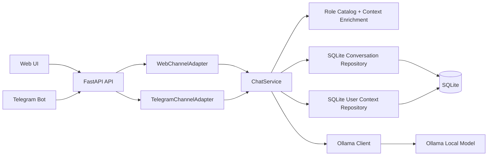
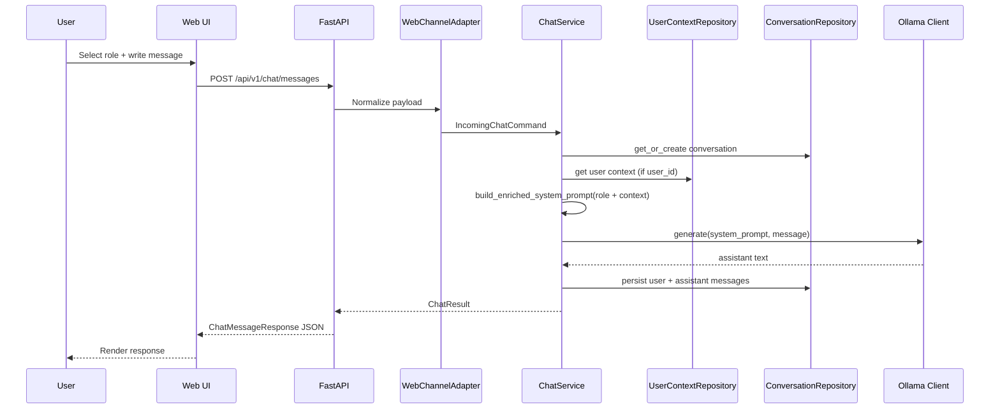
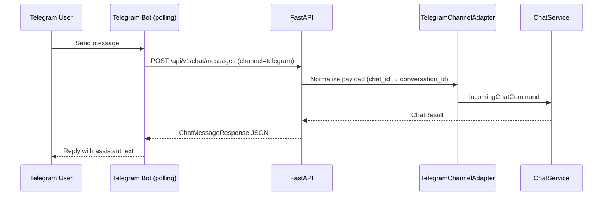

# Intelligent Role-Based Chat

An extensible chat application where the user selects a role before asking a question, and the system adapts the LLM prompt to respond with the expected tone, depth, and perspective.

This project is designed as a practical foundation for **role-driven conversational AI**, using **FastAPI**, **SQLite**, and **Ollama** for local inference. The current MVP includes a minimal web interface and a modular backend prepared for future channel integrations such as WhatsApp.

---

## Table of Contents

- [Project Overview](#project-overview)
- [Why This Project Exists](#why-this-project-exists)
- [Current Features](#current-features)
- [Architecture](#architecture)
- [Request Flow](#request-flow)
- [Tech Stack](#tech-stack)
- [Role Catalog](#role-catalog)
- [User Context](#user-context)
- [API Overview](#api-overview)
- [Project Structure](#project-structure)
- [Getting Started](#getting-started)
- [Configuration](#configuration)
- [Running the Application](#running-the-application)
- [Telegram Bot Guide](#telegram-bot-guide)
- [Running Tests](#running-tests)
- [Current Limitations](#current-limitations)
- [Roadmap](#roadmap)
- [Development Workflow](#development-workflow)

---

## Project Overview

The application allows a user to:

1. Select a conversational role.
2. Send a message.
3. Route that message through a role-specific system prompt.
4. Generate a response through a local Ollama model.
5. Persist the conversation and message history in SQLite.

The goal is not only to provide a working chat experience, but also to demonstrate a clean and scalable architecture for **agentic role-based behavior** without prematurely over-engineering the system.

---

## Why This Project Exists

Most AI chat demos stop at “send prompt, get answer”. This project goes one step further by introducing **role-aware behavior** as a first-class concept.

That makes it useful for:

- **Academic evaluation**: demonstrates prompt engineering, local LLM usage, structured backend design, and persistence.
- **Portfolio presentation**: shows practical software architecture around AI instead of just UI wiring.
- **Future collaboration**: provides a maintainable base for adding channels such as WhatsApp without rewriting the conversation engine.

---

## Current Features

### Implemented

- FastAPI backend serving API endpoints and static frontend assets
- Local persistence with SQLite (conversations, messages, user context)
- Ollama integration through HTTP
- Minimal web UI for sending messages
- Fixed role catalog with four role profiles
- Role-specific system prompts enriched with per-user context
- Conversation and message history retrieval
- Centralized error handling with consistent API envelopes
- Multi-channel architecture: Web and Telegram adapters implemented
- **Telegram bot** with polling, role selection, and context management
- **User context system**: per-user profiles that personalize LLM responses per role

### Included Roles

- `profesor`
- `programador`
- `psicologo`
- `negocios`

---

## Architecture

The system follows a **modular monolith** approach with hexagonal architecture principles.

- **FastAPI** is the composition root and HTTP interface.
- **ChatService** is the application core — channel-agnostic.
- **Channel adapters** normalize each transport's payload into a standard `IncomingChatCommand`.
- **SQLite repositories** persist conversations, messages, and user context.
- **Ollama client** handles local LLM requests.
- **Telegram bot** runs independently via polling, calling the FastAPI backend over HTTP.



### Architectural Intent

Transport concerns stay outside the core. Each channel adapter converts its specific payload into the same `IncomingChatCommand` that `ChatService` understands. Adding a new channel (e.g. WhatsApp) requires only a new adapter class — the service, repositories, and LLM client remain untouched.

---

## Request Flow

The core business flow is intentionally simple and traceable.

**Web channel:**



**Telegram channel:**



---

## Tech Stack

| Layer | Technology | Purpose |
|---|---|---|
| Backend API | FastAPI | HTTP API and static file serving |
| Web Server | Uvicorn | Local ASGI runtime |
| Persistence | SQLite | Conversations, messages, and user context |
| ORM / DB Access | SQLAlchemy | Database models and repository implementation |
| LLM Integration | Ollama (HTTP) | Local model inference |
| HTTP Client | httpx | Calls to Ollama API and internal API from bot |
| Settings | pydantic-settings | Environment-based configuration |
| Testing | pytest | Unit, integration, and contract tests |
| Frontend | HTML, CSS, JavaScript | Minimal browser-based chat UI |
| Telegram Bot | python-telegram-bot 21 | Polling-based Telegram integration |

---

## Role Catalog

The current role catalog is intentionally fixed and versioned in code.

| Role ID | Label | Behavior |
|---|---|---|
| `profesor` | Profesor | Explains concepts clearly, step by step, with simple examples |
| `programador` | Programador | Prioritizes technical accuracy, best practices, and useful code examples |
| `psicologo` | Psicólogo | Uses empathetic, careful, reflective language |
| `negocios` | Negocios | Focuses on strategy, impact, and actionable trade-offs |

These role definitions are implemented in:

- `backend/app/domain/roles.py`

---

## User Context

Each user can have a persistent profile that the system injects into the LLM's system prompt, personalizing every response without the user having to repeat themselves.

### How it works

1. When a message includes a `user_id`, the service fetches the stored context for that user.
2. `build_enriched_system_prompt(role, user_context)` appends the relevant profile fields to the base role prompt.
3. The enriched prompt is sent to Ollama — the model responds with full awareness of the user's background.

### Profile fields per role

| Role | Profile stored | Key fields |
|---|---|---|
| `profesor` | `educational_profile` | `materias`, `nivel`, `dificultades`, `estilo_enseñanza`, `objetivos` |
| `programador` | `technical_profile` | `lenguajes`, `nivel`, `proyectos`, `estilo_explicacion` |
| `psicologo` | `psychological_profile` | `sentimientos`, `situaciones_estresantes`, `objetivos_bienestar`, `preferencias_comunicacion` |
| `negocios` | `company_info` | `mision`, `vision`, `valores`, `productos`, `politicas`, `horarios`, `faqs` |

Context is stored in SQLite and survives bot or server restarts. It can be updated at any time via the `/api/v1/context/users/{user_id}` endpoint or through the Telegram bot's `/actualizar_contexto` command.

---

## API Overview

### `GET /api/v1/health`

Returns a basic health status for the backend.

### `GET /api/v1/roles`

Returns the available role catalog.

Example response:

```json
[
  {
    "id": "profesor",
    "label": "Profesor",
    "description": "Explains clearly, step by step, with simple examples."
  }
]
```

### `POST /api/v1/chat/messages`

Sends a chat message through the role-aware conversation flow.

Example request:

```json
{
  "role": "programador",
  "message": "Explain dependency injection in FastAPI",
  "conversation_id": null
}
```

Example response:

```json
{
  "conversation_id": "uuid",
  "role": "programador",
  "channel": "web",
  "user_message": {
    "id": "uuid",
    "content": "Explain dependency injection in FastAPI",
    "created_at": "2026-04-18T00:00:00Z"
  },
  "assistant_message": {
    "id": "uuid",
    "content": "Dependency injection in FastAPI allows...",
    "created_at": "2026-04-18T00:00:01Z"
  },
  "model": "llama3.1"
}
```

### `GET /api/v1/chat/conversations/{conversation_id}/messages`

Returns the conversation history in chronological order.

### `GET /api/v1/context/users/{user_id}`

Returns the stored context for a user.

### `POST /api/v1/context/users/{user_id}`

Creates or updates the context for a user. Only fields included in the body are updated; omitted fields are left unchanged.

Example request:

```json
{
  "technical_profile": {
    "lenguajes": ["Python", "JavaScript"],
    "nivel": "Intermedio",
    "proyectos": "API REST con FastAPI",
    "estilo_explicacion": "con ejemplos"
  }
}
```

### `POST /api/v1/telegram/messages`

Manual testing endpoint that simulates a Telegram message. In production this would be the webhook target.

Example request:

```json
{
  "chat_id": 123456789,
  "user_id": 123456789,
  "text": "Explicame qué es una función pura",
  "role": "profesor"
}
```

---

## Project Structure

```text
.
├── backend/
│   ├── app/
│   │   ├── api/
│   │   │   ├── routes/
│   │   │   │   ├── chat.py         # POST /chat/messages, GET history
│   │   │   │   ├── context.py      # GET/POST /context/users/{user_id}
│   │   │   │   ├── telegram.py     # POST /telegram/messages (testing)
│   │   │   │   ├── roles.py
│   │   │   │   └── health.py
│   │   │   └── schemas/
│   │   ├── application/
│   │   │   ├── ports/              # Interfaces: ChannelAdapter, LLMClient, repositories
│   │   │   └── services/
│   │   │       └── chat_service.py # Core business logic
│   │   ├── domain/
│   │   │   ├── models.py           # IncomingChatCommand, ChatResult, UserContext
│   │   │   └── roles.py            # ROLE_CATALOG + build_enriched_system_prompt
│   │   ├── infrastructure/
│   │   │   ├── channels/
│   │   │   │   ├── web_adapter.py
│   │   │   │   └── telegram_adapter.py
│   │   │   ├── db/
│   │   │   │   ├── models.py       # ORM: Conversation, Message, UserContext
│   │   │   │   ├── session.py
│   │   │   │   └── repositories/
│   │   │   └── llm/
│   │   │       └── ollama_client.py
│   │   ├── static/                 # Web UI
│   │   ├── config.py
│   │   └── main.py
│   ├── tests/
│   │   ├── contract/
│   │   ├── integration/
│   │   └── unit/
│   ├── telegram_bot.py             # Telegram bot (polling)
│   ├── .env.example
│   └── requirements.txt
├── Chat_inteligente_con_roles.md
├── pytest.ini
└── README.md
```

---

## Getting Started

### Prerequisites

Make sure you have:

- **Python 3.10+**
- **Ollama** installed and running locally
- The `llama3.1` model pulled (or any model configured in `.env`)

```bash
ollama pull llama3.1
ollama list   # verify it appears
```

---

## Configuration

Copy the example environment file:

```bash
cp backend/.env.example backend/.env
```

Environment variables currently supported:

| Variable | Description | Default |
|---|---|---|
| `DATABASE_URL` | SQLite database connection string | `sqlite:///./chat_roles.db` |
| `OLLAMA_BASE_URL` | Base URL of the Ollama HTTP API | `http://localhost:11434` |
| `OLLAMA_MODEL` | Model name used for generation | `llama3.1` |
| `OLLAMA_TIMEOUT_SECONDS` | Timeout for model requests | `30` |
| `TELEGRAM_BOT_TOKEN` | Token from @BotFather — required for the Telegram bot | _(empty)_ |

---

## Running the Application

### 1. Create and activate a virtual environment

```bash
cd backend
python -m venv venv
source venv/bin/activate
```

### 2. Install dependencies

```bash
pip install -r requirements.txt
```

### 3. Configure environment

```bash
cp .env.example .env
# Edit .env and set TELEGRAM_BOT_TOKEN if you want the Telegram bot
```

### 4. Start the backend

```bash
# From inside backend/
uvicorn app.main:app --reload
```

### 5. Open the web UI

```text
http://127.0.0.1:8000/
```

---

## Telegram Bot Guide

The Telegram bot runs as a separate process alongside the FastAPI server. It uses **polling** (no public URL required) and communicates with the backend over HTTP.

### Setup

1. Talk to [@BotFather](https://t.me/BotFather) on Telegram, create a bot, and copy the token.
2. Add the token to `backend/.env`:

```env
TELEGRAM_BOT_TOKEN=123456:ABC-your-token-here
```

3. With the FastAPI server already running, start the bot in a second terminal:

```bash
cd backend
source venv/bin/activate
python telegram_bot.py
```

### Available commands

| Command | Description |
|---|---|
| `/start` | Welcome message and role selector keyboard |
| `/cambiar_rol` | Switch to a different role (starts a new conversation) |
| `/actualizar_contexto` | Fill in your personal profile for the active role |
| `/contexto` | View your currently stored context |
| `/historial` | Show the last 10 messages of the current conversation |
| `/cancelar` | End the current conversation |
| `/help` | Show command reference |

### Personalizing responses with context

The bot can store a profile per role so the LLM always knows who it is talking to. Use `/actualizar_contexto` after selecting a role and answer the 4 questions:

- **Profesor**: materias que estudiás, nivel, dificultades, estilo de aprendizaje
- **Programador**: lenguajes, nivel, proyectos actuales, estilo de explicación
- **Psicólogo**: estado emocional, situaciones estresantes, objetivos, preferencias de comunicación
- **Negocios**: misión, visión, productos/servicios, valores

Context persists across sessions in SQLite. You can update it at any time by running `/actualizar_contexto` again.

### How conversation continuity works

The Telegram `chat_id` is used as the conversation identifier. Changing roles with `/cambiar_rol` starts a fresh conversation so role-specific history stays clean. Restarting the bot preserves all history because it is stored in SQLite, not in memory.

---

## Running Tests

Run the full test suite from the project root:

```bash
pytest
```

The repository includes:

- **unit tests** for the conversation service
- **integration tests** for the API and SQLite repository
- **contract tests** for the Ollama adapter

---

## Current Limitations

The project is functional but intentionally scoped.

### Not included yet

- WhatsApp integration (`bot-whatsapp` + Baileys)
- Authentication / authorization
- Streaming responses
- RAG, embeddings, or vector databases
- Multimedia messaging support (images, voice)
- Production-grade observability and retry pipelines
- Admin panel for managing conversations and context

---

## Roadmap

### Completed

- [x] Bootstrap FastAPI backend
- [x] Add role-aware conversation flow
- [x] Integrate Ollama through HTTP
- [x] Add SQLite persistence
- [x] Add minimal web interface
- [x] Add automated test suite
- [x] Implement Telegram bot with polling
- [x] Add user context system with per-role profile enrichment
- [x] Multi-channel routing (web + telegram) through shared `ChatService`

### Next logical steps

- [ ] Integrate WhatsApp through a dedicated Node bridge (`bot-whatsapp` + Baileys)
- [ ] Add regression tests for multi-channel behavior and context enrichment
- [ ] Add smoke-test documentation for real Ollama execution
- [ ] Streaming responses for faster perceived latency

---

## Development Workflow

The repository is moving toward a stricter delivery workflow for upcoming features:

- Git branches per feature
- Issues per scoped change
- Pull requests for review
- Spec-driven development for meaningful changes

This keeps the project aligned with maintainable engineering practices as the system evolves from MVP to multi-channel architecture.

---

## Final Notes

This project is intentionally honest about its current state:

- it already demonstrates real AI application structure,
- it has a working role-based conversation flow,
- and it is prepared for future channel expansion,

but it does **not** pretend to be a finished multi-channel production platform yet.

That is a strength, not a weakness.

It means the foundation is being built correctly.
